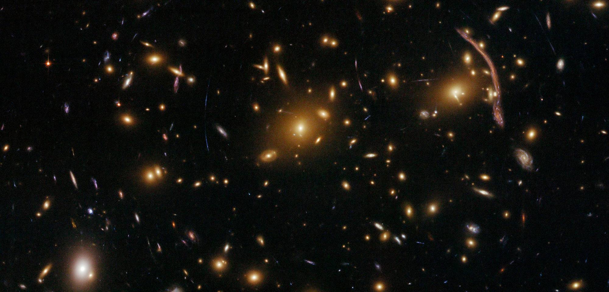

<!--  -->

## About Me
I recently completed my Master’s in Astronomy at IIT Indore, where my research focused on **high-resolution HI 21-cm absorption studies** of the **multiphase interstellar medium** using large radio datasets. My work combined **observational astronomy**, **data analysis**, and **statistical modeling** to study galaxy evolution through neutral hydrogen.

Alongside research, I enjoy expanding my knowledge in **Bayesian inference** and its applications in astronomy. I also enjoy writing Python scripts to automate and analyze radio data (using tools like CASA), and working on open science problems. I’m currently preparing for a PhD, where I aim to deepen my understanding of the universe and continue working at the intersection of astronomy, statistics, and computation.

## Connect with Me

<-- -->
<--  -->

## Skills
**Programming & Libraries** : Python (NumPy, SciPy, Matplotlib, Astropy, Pandas, Statsmodels)  
**Radio Astronomy Tools** : CASA, WSClean   
**Astronomical Simulations** : N-body, ReionYuga, FoF Halo Finder, Kelvin-Helmholtz Instability  
**Data Reduction Pipelines** : GARUDA, SPAM  
**Operating Systems & Documentation** : Linux, Windows, LaTeX, MS Office  
**Soft Skills** : Scientific Writing, Public Speaking, Research Presentation, Attention to Detail  
<!-- **Data Science Skills** : Data Cleaning, Data Visualization, Data Analysis --> 

## Achievements
**AIR 317 in IIT JAM Physics (2023) and joined M.Sc. Astronomy at IIT Indore**  
**AIR 331 in JEST (2023)**  
**Received Merit-cum-Means Scholarship from IIT Indore**
